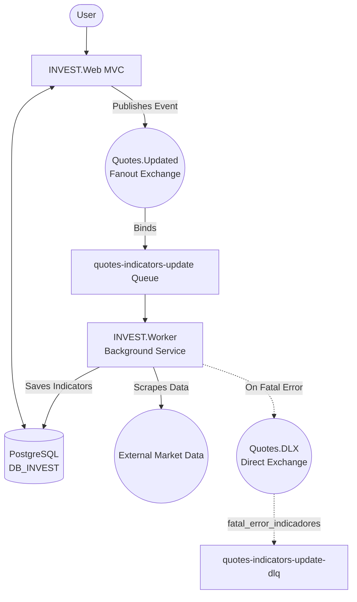

# INVEST.Web — Distributed Investment Tracker
[](https://github.com/mrodriguesweb/INVEST.Web/actions/workflows/ci.yml)

An investment tracking ecosystem built with **ASP.NET Core MVC, PostgreSQL, and RabbitMQ**. 

This repository serves as a portfolio showcase of **Event-Driven Architecture (EDA)**, **Clean Architecture**, and **Resilient Background Processing**. Originally built over Azure PaaS (Functions, Service Bus), the architecture has been refactored into a fully containerized distributed system using Docker Compose, demonstrating platform-agnostic engineering skills.

## Demo
<p align="center">
  
</p>

---

## 🚀 Core Features & Technical Highlights

### 1. Event-Driven Messaging (RabbitMQ)
The application decouples the user-facing web interface from heavy data-gathering tasks using asynchronous messaging.
* **Producer/Consumer Pattern:** The Web MVC acts as a publisher, emitting domain events. Dedicated .NET Background Service Workers consume these events at their own pace.
* **Smart Topology:** Utilizes `Fanout` exchanges for Pub/Sub scenarios (e.g., broadcasting `QuoteUpdated` events) and `Direct` exchanges for precise error routing.
* **Resilience & DLQ:** Implements a robust Dead-Letter Queue (DLX/DLQ) strategy. Poison messages (e.g., scraping failures) are gracefully rejected (`requeue: false`) and routed to a centralized graveyard queue with specific routing keys (`fatal_error_indicadores`) for later inspection, preventing CPU-spiking infinite loops.

### 2. Resilient Web Scraping & Integration
A dedicated worker (`AtualizarIndicadoresWorker`) connects to an undocumented external provider to fetch financial indicators (EBITDA, ROE, Net Margin).
* **Reverse Engineering:** Extracts internal company IDs via regex DOM parsing and maps raw JSON arrays into Domain Entities.
* **Anti-Ban Strategies:** Implements customized `HttpClient` headers (spoofing User-Agents and Referers) and randomized **Jitter** delays between requests to prevent IP blocking by Cloudflare.
* **Graceful Shutdown:** The worker passes `CancellationToken`s down to the Entity Framework Core repository, ensuring database transactions are not corrupted if the Docker container is stopped mid-process.

### 3. Clean Architecture & DDD Concepts
Dependencies point inward, strictly separating concerns:
* **Domain:** Encapsulates business rules, Aggregates (`Acao` / `Tickers`), and invariants (e.g., Ticker names cannot be edited after creation).
* **Application:** Orchestrates use cases, DTOs, and messaging contracts.
* **Infrastructure:** Manages EF Core (PostgreSQL) persistence, RabbitMQ connections, and external HTTP clients.
* **Web / Worker:** Entry points restricted to HTTP handling and AMQP consumption, respectively.

---

## 🏗️ Architecture Topology



---

## ⚙️ Quickstart (Docker Compose)

The entire infrastructure (Web App, Background Workers, PostgreSQL database, PgAdmin, and RabbitMQ message broker) is orchestrated via Docker Compose.

**1. Clone the repository**
```bash
git clone [https://github.com/mrodriguesweb/INVEST.Web.git](https://github.com/mrodriguesweb/INVEST.Web.git)
cd INVEST.Web
```

**2. Setup Environment Variables**
Create a `.env` file in the root directory to hold sensitive credentials (this file is git-ignored):
```env
DB_PASSWORD=your_secure_db_password
EMAIL_PASSWORD=your_app_password
```

**3. Spin up the cluster**
```bash
docker compose up -d --build
```

**Access Points:**
* **INVEST.Web App:** `http://localhost:8080`
* **RabbitMQ Management UI:** `http://localhost:15672` (guest / guest)
* **PgAdmin:** `http://localhost:5050`

---

## 📈 Future Improvements (Roadmap)
- [ ] **Polly Integration:** Introduce `IHttpClientFactory` policies (Circuit Breaker and Exponential Backoff) for network transient faults before falling back to the RabbitMQ DLQ.
- [ ] **Observability:** Add OpenTelemetry tracing to correlate Web requests with Background Worker executions.
- [ ] **Unit Testing:** Expand coverage for Application Handlers and Domain entities.
