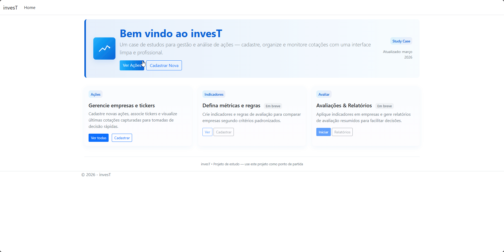

# INVEST.Web — Investment Tracker (WIP)

Investment tracker (WIP) built with **ASP.NET Core MVC + EF Core (PostgreSQL)**, applying Clean Architecture, DDD-style aggregates (Acao/Tickers) and Docker Compose (App + Postgres).  
Focus: maintainability, testability, and separation of concerns.

Repository: https://github.com/mrodriguesweb/INVEST.Web

> WIP means the project is intentionally incomplete: it is being evolved in small iterations to practice architecture + business rules.

## Demo
<p align="center">
  
</p>

## Features (current)
- CRUD de **Ação** (Create / Edit / Delete).
- **Tickers** como coleção da Ação (normalização e sincronização via método de domínio).
- Regra: **Name não é editável** após criação (imutabilidade por design: comando de edit não aceita Name).
- Separação Read/Write:
  - Reads retornam DTOs (queries).
  - Writes carregam agregados via repositório.
- **Error handling**
  - Erros esperados (validation/not found) retornam status/feedback na UI.
  - Erros inesperados (exceptions) são capturados por handler global e logados.
  - Páginas customizadas de status code (ex.: 404) via `UseStatusCodePagesWithReExecute`. (ver seção abaixo)

---

## Architecture (Clean Architecture)
A aplicação é organizada em camadas, mantendo dependências apontando para dentro.

- **Web (ASP.NET Core MVC)**
  - Controllers + Views + ViewModels.
  - Validação de formato (ModelState / DataAnnotations).
  - Mapeamento ViewModel → Command.
  - Tratamento global de exceptions (borda).
- **Application**
  - Use Cases/Handlers (Create/Edit/Delete) + Commands/Results.
  - Orquestração do fluxo e regras do caso de uso.
  - Depende de abstrações (ex.: IAcaoRepository, ISetorQuery).
- **Domain**
  - Entidades e comportamento (ex.: `Acao.ReplaceTickers(...)`).
  - Invariantes do agregado.
- **Infrastructure**
  - EF Core + PostgreSQL (Npgsql).
  - Implementações de Repositórios/Queries.
  - Migrations.

---

## Error handling (como funciona)
Este projeto separa:
- **Erros esperados** (ex.: entidade não encontrada, validação) → retornos controlados no fluxo normal (ex.: `NotFound()` / mensagens de validação).
- **Erros inesperados** (ex.: exception de infra/banco/bug) → capturados pelo middleware de exception handling (`UseExceptionHandler`) e logados.

Também existem páginas customizadas de status code (ex.: 404) via `UseStatusCodePagesWithReExecute("/StatusCode/{0}")`.

---

## Tech Stack
- .NET (ASP.NET Core MVC)
- Entity Framework Core
- PostgreSQL
- Npgsql EF Core Provider

---

## Quickstart (Docker)
Pré-requisitos: Docker Desktop (ou Docker Engine) com Docker Compose habilitado.

Subir a aplicação + Postgres (na raiz do repo):

```bash
docker compose up --build
```

A aplicação ficará disponível em: http://localhost:8080

**Observação**: na primeira execução, o projeto aplica migrations e faz um seed inicial (se configurado).
